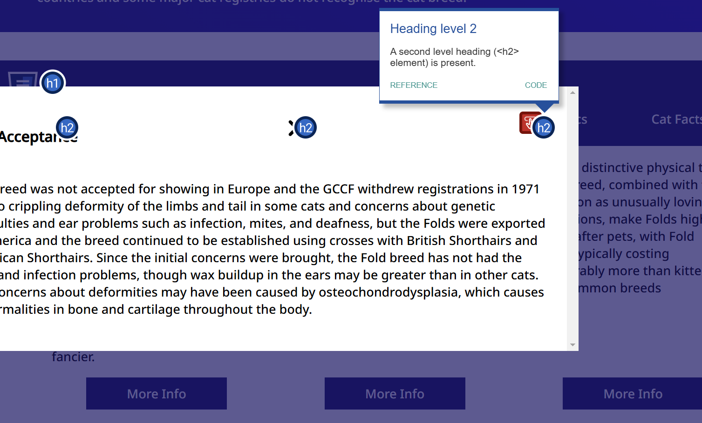
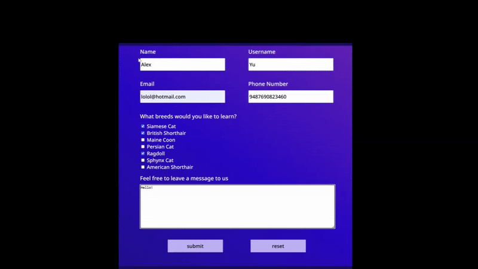

## Code Review Exercise

Write your code review here in markdown format. 

## Issue #1 Accessibility: ##

The issue, why this is an issue, and the solution.

To start off, using an accessibility evaluation tool like wave, it points out that there are two empty buttons. What this means is that "a button is empty or has no value text" and what that means is that it is missing elements assitive technologies like screen readers are unable to interpret the purpose of these buttons. The reason why this is so important is because it impacts the accessbility and user experience. Without clear labels or descriptions, users with visual impairments could possibily make the webpage unusable. 

The solution to this is to simply add the an aria-label exactly like how it has already been done in the code of the pop up next to it. 

```html
    <span ...>*aria-label="close popup window"*</span>
```




## Issue #2 Form Information: ##

For this issue, I noticed that the two buttons, 'Submit' and 'Reset,' located at the end of the page, not only fail to submit or reset but also do nothing at all, as there is no JavaScript code attached to them. While this may be just be a placeholder for the form submission, I believe that it is important to at least have code that saves the information similarly to the last assignment where it required us to collect the form data and print it to the console.

Adding JavaScript to handle form data helps make it clear what the form is supposed to do, even if it's still a work in progress. For example, using JavaScript to capture user input, check it, and print it to the console—like we did in the last assignment—shows that the form can collect and process data. This is useful for making sure everything is set up correctly, and it also creates a good starting point for adding more features later, like sending the data to a server or giving users feedback as they fill out the form. Even small functionality like this makes placeholders more useful and practical.

The solution to this is to add Javascript code that connects to the form similarly to assignment 3 starships:

```javascript
    form.addEventListener('submit', (event) => {
        ...
    })
```




## Issue 3 HTML Semantics: ##

For the third significant issue, I found that the reset button, as well as the submit button, doesn't have any functionality. As a result, both buttons currently serve no purpose and could potentially cause inconvenience, frustration, and confusion for users. This is due to the fact that they are not associated with the form within the index.html. This can be fixed by moving the the buttons inside the form so they automatically reset and submit.

```html
    <div
        class="form space-evenly-distributed-row-container form-buttons-container">
        <input class="form-button" type="submit" value="submit" />
        <input class="form-button" type="reset" value="reset" />
    </div>
</form>
```

## Issue 4 more HTML Semantics: ##

The last issue I found was a checkbox naming consistency where in lines 439 and below, the cats could possibly have the same name attribute. For grouping checkboxes under the same category, they should share a single name value since this could make data handling easier when the form is submitted.

```html
    <input type="checkbox" id="siamese" name="breed1" value="siamese" />

    <input type="checkbox" id="british-shorthair" name="breed2" value="british-shorthair" />

```